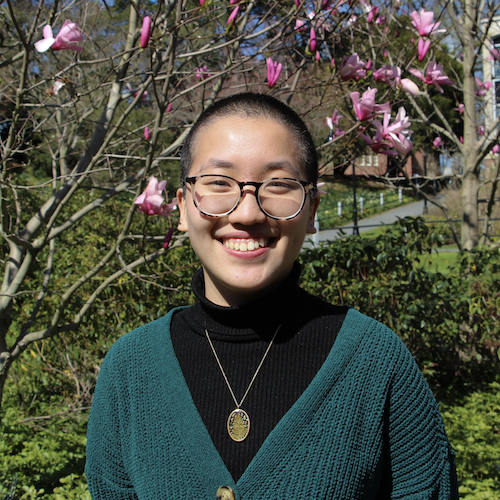
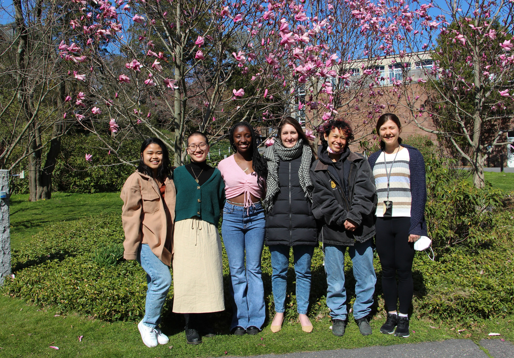

## About

The Data Ethnography and Advocacy Lab is a multi-disciplinary research group investigating the constitution, governance, and dissemination of public interest datasets in the United States. We study the socio-technical processes by which datasets get produced, considering how data emerge in the contexts of certain conditions of labor, varied institutional commitments, and technological affordances. We also examine the cultural processes by which diverse communities assign meaning to data: how diverse social groups advocate for data certain definitions and categorizations, how stakeholders determine what counts as relevant data "context," and how communities decide when the values reported in data reach actionable levels. In foregrounding these aspects of data provenance, our work furthers understanding of both the promise and the limits of contemporary transparency initiatives and regulations. DEAL is working to innovate new approaches to ethnographically examining data infrastructures, work, and advocacy, drawing on both methodologies and sensibilities from experimental ethnographic traditions and adapting them to the study of data environments. We consider how creative computational data work can help expose some of the conditions of data production. Our work is informed by and contributes to the fields of critical data studies, information studies, and science and technology studies. Further, our work helps to identify opportunities for strengthening U.S. data collection programs, improving data documentation practices, and cultivating deeper data infrastructure literacy.

## Lab Members

### Juniper Huang

My name is Juniper Huang, and I have been a part of this research since the Fall of 2021 as a Critical Data Analyst. I am currently a second-year Statistical Data Science major at Smith College. I am passionate about metadata and the many different factors that affect a dataset. Outside of research, I am the Head of New Students for Talbot House, I am part of the Pan-Asian in Action e-board, and I am an active member of the Statistical Data Science Coalition of Color.

### Alumni

* Sena Amuzu (Spring '22)
* Anika Arifin (Fall '22 - Spring '23)
* Emarie de la Nuez (Spring '22)
* Naomi Liftman (Summer '22 - Spring '23)
* Mags McLaughlin (Fall '22)
* Nicole Tresvalles (Spring '22)
* Quinn White (Spring '22)
* Ziqi Zhen (Fall '22 - Spring '23)

## Lab Book

See our lab protocols [here](/lab-book/).

