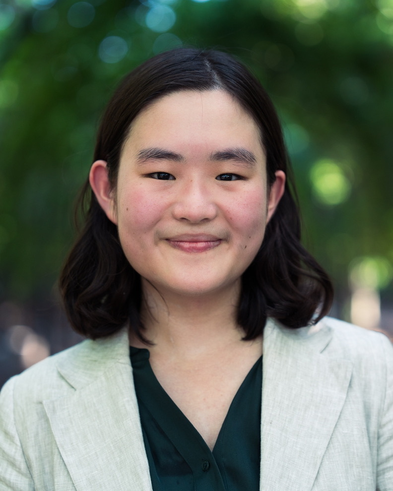
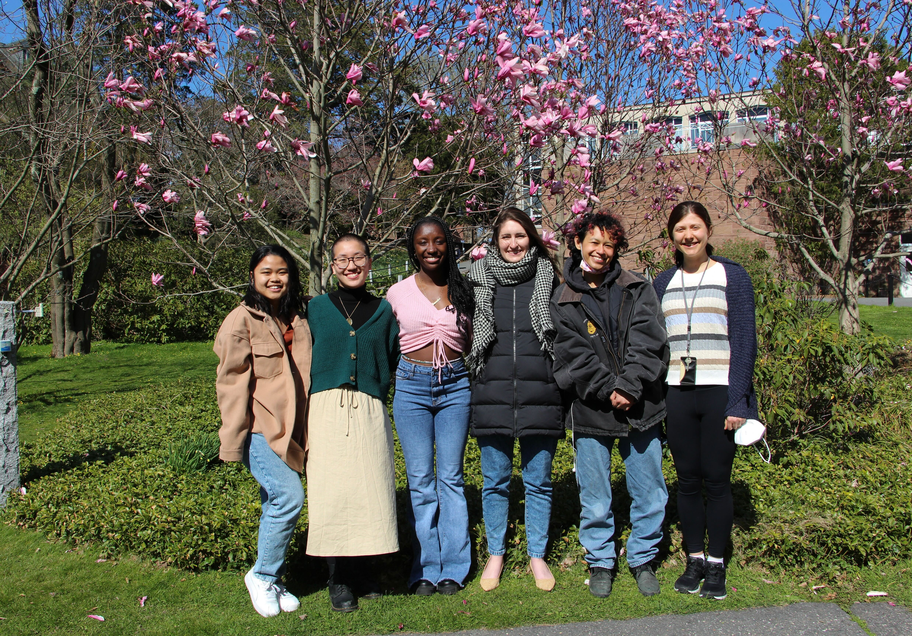

## About

The Data Ethnography and Advocacy Lab is a multi-disciplinary research group investigating the constitution, governance, and dissemination of public interest datasets in the United States. We study the socio-technical processes by which datasets get produced, considering how data emerge in the contexts of certain conditions of labor, varied institutional commitments, and technological affordances. We also examine the cultural processes by which diverse communities assign meaning to data: how diverse social groups advocate for data certain definitions and categorizations, how stakeholders determine what counts as relevant data "context," and how communities decide when the values reported in data reach actionable levels. In foregrounding these aspects of data provenance, our work furthers understanding of both the promise and the limits of contemporary transparency initiatives and regulations. DEAL is working to innovate new approaches to ethnographically examining data infrastructures, work, and advocacy, drawing on both methodologies and sensibilities from experimental ethnographic traditions and adapting them to the study of data environments. We consider how creative computational data work can help expose some of the conditions of data production. Our work is informed by and contributes to the fields of critical data studies, information studies, and science and technology studies. Further, our work helps to identify opportunities for strengthening U.S. data collection programs, improving data documentation practices, and cultivating deeper data infrastructure literacy.

## Lab Members

### Nicole Choi

Nicole is a senior studying Statistical & Data Sciences and Russian Area Studies at Smith College. She is also a professionally fluent Korean speaker with interests spanning qualitative analysis, foreign and domestic policy analysis, and language studies.

### Alumni

* Sena Amuzu (Spring '22)
* Anika Arifin (Fall '22 - Spring '23)
* Emarie de la Nuez (Spring '22)
* Sophia Hillard (Fall '25)
* Juniper Huang (Fall '24 - Spring '25)
* Gabrielle Kraft (Fall '25)
* Naomi Liftman (Summer '22 - Spring '23)
* Casey MacGibbon (Fall '24 - Spring '25)
* Mags McLaughlin (Fall '22)
* Nicole Tresvalles (Spring '22)
* Quinn White (Spring '22)
* Ziqi Zhen (Fall '22 - Spring '23)

<!---->

## Lab Book

See our lab protocols [here](/lab-book/).

